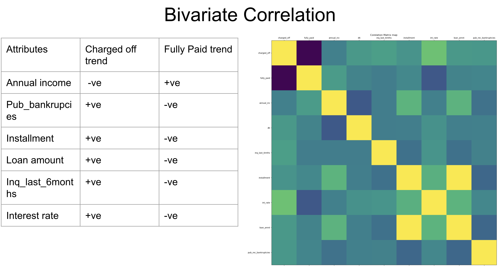

# Project Name
> Lending Club analysis

## Table of Contents
* [General Info](#general-information)
* [Technologies Used](#technologies-used)
* [Conclusions](#conclusions)
* [Acknowledgements](#acknowledgements)

<!-- You can include any other section that is pertinent to your problem -->

## General Information
Lending Club (LC) is the largest online marketplace facilitating a variety of retail loans.
Lending Club (LC) wants to identify patterns from past loan applicants and whether an applicant is likely to default.
The objectives of the case study are to :
Identify risky loan applicants to minimise credit loss
To understand how consumer attributes and loan attributes influence the tendency of default.
Identify variables that are possible causes for loan default
Provide recommendations on the attributes that could cause loan default

<!-- You don't have to answer all the questions - just the ones relevant to your project. -->

## Conclusions

## Technologies Used
- Numpy
- Pandas
- Chardet
- Matplotlib
- Seaborn
